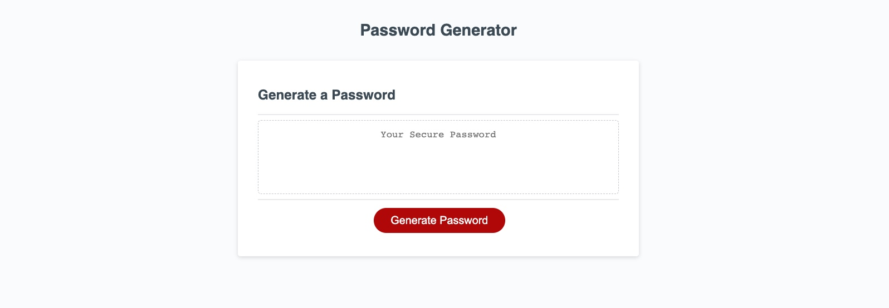

# Password Generator Starter Code

## Description

This is an online password generator with the following acceptance criteria:
GIVEN I need a new, secure password 
WHEN I click the button to generate a password 
THEN I am presented with a series of prompts for password criteria 
WHEN prompted for password criteria 
THEN I select which criteria to include in the password 
WHEN prompted for the length of the password 
THEN I choose a length of at least 8 characters and no more than 128 characters 
WHEN asked for character types to include in the password 
THEN I confirm whether or not to include lowercase, uppercase, numeric, and/or special characters 
WHEN I answer each prompt 
THEN my input should be validated and at least one character type should be selected 
WHEN all prompts are answered 
THEN a password is generated that matches the selected criteria 
WHEN the password is generated 
THEN the password is either displayed in an alert or written to the page 

## Installation

N/A

## Usage

Password generator web app has a working interface and "generate" button to create a random password. The user is prompted with questions pertaining to password character length (must be between 8-128) and whether you want lower case, upper case, or symbols. If you cancel all of them the password will not be considered complex and return nothing. 

## Credits

NA

## Link to live website

[link](https://qaizen.github.io/pwgenerator/)

## Link to github repository

[link](https://github.com/Qaizen/pwgenerator)

## PW generator web app screenshot

## License

N/A
